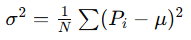
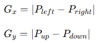

## DPC(Bad Point Correction)------坏点校正

### DPD 壞點檢測（Defective Pixel Detection）
### RockChip 內容進行說明
這類演算法的目的，是在 RAW Bayer 圖上找出：

Dead Pixel（死點，永遠黑）
Hot Pixel（亮點，永遠亮）
Stuck Pixel（固定值）
Random Defect（隨機異常）
Cluster Defect（群聚壞點）

**Rockchip 的文件通常不會完整公開所有細節，但從 ISP/Camera tuning 的常見設計，可以大致推導這些算法的運作方式。**
### 說明內容 :
1. 每個算法在做什麼
2. 核心計算邏輯
3. ISP 實際操作流程
4. 常見 tuning 方法
5. 各算法差異比較
## 一、ISP 壞點檢測的基本概念
在 RAW Bayer 圖裡：
1. 每個 pixel 都應該與周圍 pixel 有「空間連續性」
2. 如果某 pixel 與鄰居差異過大
3. 且不符合 edge / texture 特性
4. 就可能是 defect pixel

### 典型檢測流程：
```
RAW Input
   ↓
Neighborhood Sampling
   ↓
Threshold Compare
   ↓
Direction / Gradient Check
   ↓
Bad Pixel Decision
   ↓
Pixel Replacement
```
通常 replacement 會用：
 - 鄰域平均
 - 同色 interpolation
 - directional interpolation

## 二、RK（RK坏点判定算法）

這通常是 Rockchip 自己的「標準壞點檢測」。

特點：

中等複雜度
平衡誤判與漏判
ISP realtime 常用

核心思想：

比較中心 pixel 與上下左右 / 對角鄰居。

數學形式通常類似：

設：

中心 pixel：P
鄰域平均：M

則：

∣P−M∣>T

若超過 threshold T：

→ 判定可能壞點。

但還會加入：

gradient 檢查
edge 保護

避免把 edge 當壞點。

### 操作流程
```
取 3x3 或 5x5 window
    ↓
計算鄰域平均
    ↓
比較中心點偏差
    ↓
檢查方向梯度
    ↓
若全部條件成立 → bad pixel
```
### 特性
優點：
穩定
適合一般 sensor

缺點：
對 random hot pixel 不一定最強

## 三、LC（LC坏点判定算法）

LC 很可能是：
Local Correlation（局部相關性）
它強調：
「正常 pixel 與周圍具有高相關性」。
核心：
不是只看差值，
而是看 local pattern 是否連續。

### 例如：
```
正常 edge：
10 12 14
20 22 24
30 32 34

壞點：
10 12 14
20 255 24
30 32 34
```
255 明顯破壞 local correlation。

### 常見計算

會使用：

局部 variance：  


若：

中心點偏離局部模型且 variance 不合理,則判壞點。

### 特點
優點：
edge 保護較好
不容易誤傷細節

缺點：
計算量較高

## 四、PG（PG坏点判定算法）

PG 通常是：

Pattern Gradient,利用方向梯度判斷。

因為真實影像：

edge 有方向性
壞點沒有方向一致性

### 例如：

正常 edge：
```
10 20 30
10 20 30
10 20 30

中間若變成：

10 20 30
10 255 30
10 20 30

則梯度不連續。
```
### 核心做法

計算：

 - horizontal gradient
 - vertical gradient
 - diagonal gradient

例如：



如果：

中心點與所有方向都不一致,且 gradient pattern 不合理
## → 判壞點。

### 特點

優點：

edge preservation 強,高畫質 ISP 常用

缺點：

tuning 較麻煩

## 五、RNG（RND坏点判定算法）

這應該是：

Random Defect Detection

專門抓：

 - random hot pixel
 - temporal noise defect

尤其：

 - 高 ISO
 - long exposure
 - thermal hot pixel

常見方式：

比較：

temporal frame
local statistics

例如：

某 pixel 突然遠高於周圍：

# P>μ+kσ

則可能是 random defect。

### 特點

優點：

對 hot pixel 敏感

缺點：

高 ISO 容易誤判

因此通常：

threshold 要跟 ISO 動態調整

## 六、RG（RG坏点判定算法）

RG 通常可理解成：

Regional Gradient

與 PG 類似，
但更重視區域 gradient consistency。

不是只看單 pixel。

而是：
```
局部區域是否存在連續紋理
```
核心概念

正常 edge：

 - gradient 連續

壞點：

 - gradient discontinuity

可能做法：
```
計算區域 gradient map
    ↓
比較中心 pixel 是否破壞區域模型
```
### 特點

優點：

對 cluster defect 比較有效

缺點：

latency 稍高

## 七、RO（RO坏点判定算法）

RO 很可能是：

Rank Order

這是很多 ISP 常見方法。

核心：

比較 pixel 在鄰域中的排序。

例如：

10 11 12
11 255 12
10 11 12

255 明顯是極端值。

核心方法

對 window 排序：

Sort(window)

若：

中心點排名過高
或過低

則視為 defect。

類似：

median filter 判定。

數學概念

若：

P>Q
95
	​


或：

P<Q
5
	​


則可能是壞點。

特點

優點：

robust
對 impulsive noise 很有效

缺點：

texture 區可能誤判