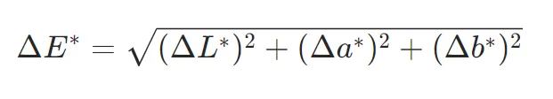
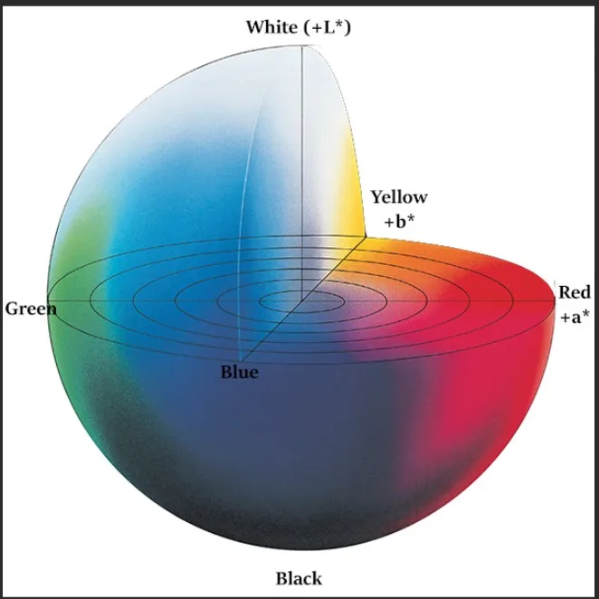

計算 Delta E (ΔE) 主要是比較標準色與樣本色在 Lab (Lab)* 空間的差異，最基礎的 CIE76 公式為 \(\Delta E_{76}=\sqrt{(\Delta L^{*})^{2}+(\Delta a^{*})^{2}+(\Delta b^{*})^{2}}\)，其中 \(\Delta L^{*}\) (亮度差)、\(\Delta a^{*}\) (紅/綠差)、\(\Delta b^{*}\) (藍/黃差) 分別是兩者對應數值的差；而 Delta C (ΔC) 則代表色度 (Chroma) 的差異，計算公式為 \(\Delta C^{*}=\sqrt{(a_{2}^{*}-a_{1}^{*})^{2}+(b_{2}^{*}-b_{1}^{*})^{2}}\)，表示顏色的鮮豔度變化。複雜的 CIEDE2000 等公式則更精確模擬人眼感知。 
## 1. 取得 Lab 值 
- 使用色度計或分光光度計測量標準色與樣本色，獲得其 Lab* 值。  
L* (亮度)：0 (黑)  to 100 (白)。  
a*：負數 (綠) to 正數 (紅)。  
b*：負數 (藍) to 正數 (黃)。   
## 2. 計算 Delta E (總色差) 
- 基本 CIE76 (最常用於簡單比對):
\(\Delta L^{*}=L_{2}^{*}-L_{1}^{*}\)  
\(\Delta a^{*}=a_{2}^{*}-a_{1}^{*}\)  
\(\Delta b^{*}=b_{2}^{*}-b_{1}^{*}\)
\(\Delta E_{76}=\sqrt{(\Delta L^{*})^{2}+(\Delta a^{*})^{2}+(\Delta b^{*})^{2}}\)   
## 3. 計算 Delta C (色度差) 
- Delta C (色度差)：比較顏色的鮮豔程度變化。  
\(\Delta C^{*}=\sqrt{(a_{2}^{*}-a_{1}^{*})^{2}+(b_{2}^{*}-b_{1}^{*})^{2}}\)  
或者 \(\Delta C^{*}=\sqrt{(\Delta a^{*})^{2}+(\Delta b^{*})^{2}}\)。  
若需要更精確的色度差（考慮明度），可以使用 CMC 或 CIEDE2000 中的色度差計算。 
## 4. 計算 Delta H (色調差) 
- Delta H (色調差)：描述顏色色相（Hue）的差異。
\(\Delta H^{*}=\sqrt{(\Delta E^{*})^{2}-(\Delta L^{*})^{2}-(\Delta C^{*})^{2}}\)。
## 5. 判讀結果 ΔE 值越小，表示顏色越接近。
- ΔE < 1：人眼通常無法察覺。
- ΔE 1-
- ΔE > 2-4：通常被視為品質控制中的最大可接受範圍，視應用而定。

# 如何計算和解釋ΔE
要進行 ΔE（Delta E）計算，首先需要測量「標準」（理想目標顏色）和「樣本」（被測試的顏色）的 L*a*b 值。

最基本的公式 ΔEab∗ (CIE76)，計算如下：

這裡，ΔL∗ 是樣品和標準 L∗ 值之間的差異，Δa∗ 和 Δb∗ 也同樣適用。

解讀結果： ΔE 值提供了一個簡單的合格/不合格指標。其一般解釋如下：

ΔE≤1.0： 大多數人察覺不到。
1.0<ΔE<2.0： 細微的差別，只有訓練有素的人才能察覺。
2.0<ΔE<3.5： 顯著的差異，往往是商業可接受性的極限。
3.5<ΔE<5.0： 顏色差異非常明顯。
ΔE>5.0： 這些顏色被認為本質上是不同的。

## 何謂L* a* b*
L* a* b* 是物體的絕對顏色。當你得到一個顏色時，你可以使用一組 L*、a* 和 b* 值來表示它，就像使用經度、緯度和海拔來確定地球上的位置一樣；你可以得到一組 L*a*b* 值來確定顏色。

L* 代表亮度，表示顏色的深淺。常規顏色的 L* 值範圍為 0~100，0 為純黑，100 為純白；

a* 是紅綠度，正值表示紅光，負值表示綠光；

b* 表示黃藍度，正值表示黃光，負值表示藍光；

!

C* 代表色度，表示顏色的亮度。數值越大，顏色越亮。它只有正值。

h°代表色相，它表示該顏色最接近的純色：紅色、橙色、黃色、綠色、青色、藍色和紫色。其值範圍為0°~360°。  

C* 與 h° 以及 a* 與 b* 之間的關係如下：
echo awb_0_1 > /proc/driver/isp

