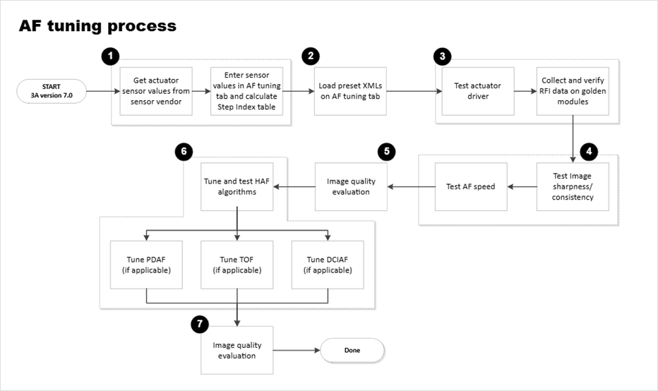

## 📄 自動對焦調整流程說明文件 (依流程圖)
### Step 1：獲取致動器 (Actuator) Sensor 值並建立 Step Index Table

>目的：取得致動器的基本參數，確保後續對焦曲線正確。

>操作內容：
>>向 Sensor Vendor 索取致動器 (Voice Coil Motor, VCM) 相關數據，例如：
>>>致動器步進範圍 (最小/最大 DAC 值)
>>>步進精度 (Step Size)
>>>響應特性

>>將參數輸入到 AF tuning 工具中，產生 Step Index Table：
>>>對應 DAC 值 ↔ Lens Position
>>>用於後續 AF 演算法運算。

### Step 2：載入預設 XML 設定
目的：快速初始化 AF 調整環境。

操作內容：

在 AF Tuning 工具中載入官方或內部提供的 預設 XML 檔案。

XML 內含：

AF 演算法預設參數

致動器控制參數

測試環境參數

Step 3：測試致動器驅動與 RFI 驗證

目的：確認硬體與軟體驅動正常。

操作內容：

致動器驅動測試：

驅動 VCM 進行全行程掃描 (從近到遠)。

確認致動器移動是否平順、無卡滯或延遲。

RFI (Radio Frequency Interference) 測試：

使用 golden sample module 測試模組在不同位置的 RFI 敏感度。

確保對焦過程不受 EMI/RFI 干擾。

Step 4：測試影像銳利度與一致性

目的：確認影像在不同焦距下的清晰度。

操作內容：

使用標準測試卡 (如 ISO 12233、灰階卡、棋盤格)。

驅動致動器掃描全範圍，記錄每個 Step 的 Sharpness Score (MTF, Gradient, Laplacian)。

確認：

峰值位置與演算法判斷一致。

多次測試結果的重現性 (Consistency)。

Step 5：測試 AF 速度

目的：評估對焦速度。

操作內容：

在不同測試距離 (近焦/中焦/無限遠) 測試 AF 收斂時間。

評估：

從模糊到清晰的時間 (Focus Lock Time)。

是否有 Hunting (來回抖動) 現象。

Step 6：高級 AF 演算法 (HAF) 與子模組調整

目的：整合並優化不同 AF 技術。

操作內容：

HAF 演算法調整：

測試多種場景 (室內/室外/弱光/移動物體)。

調整演算法參數以最佳化 AF 準確度與速度。

子模組調整 (依需求選用)：

PDAF (Phase Detection AF)：需要調整相位差校準表。

TOF (Time of Flight AF)：調整飛行時間距離參數。

DCIAF (Dual Camera AF)：雙攝像頭對焦校正與同步。

Step 7：影像品質評估

目的：確認最終 AF 演算法對影像品質影響。

操作內容：

拍攝多組測試圖樣 (自然場景、人像、低光)。

評估：

清晰度 (MTF)

一致性 (同一位置多次對焦結果是否穩定)

收斂速度

Hunting/失敗率

若有異常 → 回到 Step 6 調整。