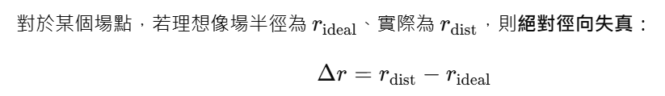
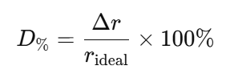

# Geometric distortion 與 TV distortion — 詳細比較
## 下面會以公式、量測方法與圖示說明這兩者的差別、常見公式與實務意義，幫你快速抓到重點與如何在報表上判讀數值。
1) 基本定義（直觀說明）

[Geometric distortion]（幾何／徑向＋切向失真）：指影像中每一點相對於理想針孔（或理想投影）位置的偏移。可以在整個影像場上用位移向量描述（常分為徑向 radial 與切向 tangential 成分）。通常用像場半徑或像素位置的差值來量化（以百分比或像素為單位）。

[TV distortion]（也稱 picture-height / TV 圖高失真、或 RIAA/EBU/SMIA 定義的 TV distortion）：是一種以「影像高度」或「邊緣直線彎曲量」來量測的標準化指標 —— 通常把一個填滿**豎直視場（vertical FOV）**的正方格或方框影像當作測試，量測邊緣（通常是頂邊）中心到角落（或中心到頂邊）的高度變化 ΔH，再以影像高度 H 做歸一化，得到百分比。TV distortion 強調「邊緣直線的彎曲程度」，而非場內每一點的向量誤差。

2) 常用公式（簡明）
### 幾何失真（radial / general）
  
### 百分比徑向失真常寫為：  

（若用像素或 mm 也可以直接以長度差表示）
### TV distortion（picture-height method）
  

不同標準（傳統 TV、SMIA/ISO 等）對 Δ𝐻 的定義細節有差異（例如 SMIA 定義會以兩個 bottom-to-top 距離來統一量測，數值上會和傳統定義成比例差）。

3) 量測方法（實務上怎麼量）

- 幾何失真：常用點陣（dot target）或格點（grid）全場量測，對每一個格點比較理想位置與實際位置，得到一張「失真向量場」或「失真曲線」（radial distortion curve）。這種方法能描述場內每一點的誤差分佈。
Edmund Optics

- TV distortion：只需一個填滿豎直視場的正方格／矩形（或拍攝邊緣直線），量測頂邊（或長邊）中點與角落的相對高度差 Δ𝐻。結果給出一個百分比，代表「畫面邊緣線看起來彎曲的程度」。這是電視/影片領域沿用的快速指標（標準如 EBU、RIAA、SMIA、ISO 有相關描述）。