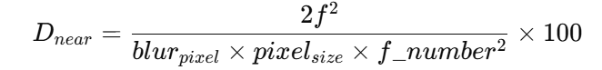

### 《Connected Smart Systems Camera Distortion Calibration》（文件號 80-PN984-15 Rev. AB, 2021年3月）
#### Qualcomm 提供的非魚眼相機鏡頭畸變校正（Lens Distortion Calibration, LDC）完整流程指南
一、📘 文件中文翻譯與技術說明摘要（逐步說明）  
# 1️⃣ 文件目的

本文件描述如何建立校正場景、擺放相機位置，並使用 Qualcomm 提供的校正軟體庫對非魚眼鏡頭進行畸變校正。
不支援魚眼鏡頭，且需要提供鏡頭廠商的初始 LDC 曲線（Vendor curve）作為起始參數。  
2️⃣ 校正流程總覽
==============================================================================
| 步驟     | 名稱                         | 內容摘要                                       |
| ------ | -------------------------- | ------------------------------------------ |
| Step 1 | 環境架設 (Environment Setup)   | 準備點陣圖 (dot chart)、光源、相機參數、擺位與距離設定。         |
| Step 2 | 影像擷取 (Capture Inputs)      | 拍攝兩張影像：「近距 sparse image」與「遠距 dense image」。 |
| Step 3 | 校正執行 (Calibration Process) | 使用 dot_chart_calib.exe 執行校正流程並產生 LDC 曲線。   |
| Step 4 | 校正驗證 (Validation)          | 使用 LdcTool 檢查去畸變後直線是否筆直、光滑。                |

# 3️⃣ 校正環境設定詳細步驟
### (1) 光源條件

使用 5500K ~ 6500K 的均勻擴散光源。

光線不能在圖卡上產生陰影或反光。

若影像雜訊太高，AEC 自動曝光增益需 < 2x。

### (2) 校正圖卡（Dot Chart）

可用軟體自動產生：
```
dot_chart_calib.exe Chart <chart_config_file> <output_pattern.svg>
```
## 圖卡計算需依以下參數：

焦距 (focal length)

感光元件 pixel 大小 (pixel_size)

鏡頭光圈值 (f-number)

目標模糊半徑 (blur_pixel)

感光元件比例 (4:3 或 16:9)

視角 (diagonal FOV)

範例：

4:3 感光元件、75° 視角、pixel size=1.12µm、f=2.8mm
建議近距離 Dnear = 約 3.2 cm，遠距離 Dfar = 約 12.3 cm。

### (3) 擺放距離計算公式

近距離 (D_near)：  
  
遠距離 (D_far)：  
  

# 4️⃣ 影像擷取說明

需拍攝兩張：

| 類型     | 名稱    | 位置    | 用途       |
| ------ | ----- | ----- | -------- |
| Sparse | 近距離影像 | Dnear | 用於光軸中心偵測 |
| Dense  | 遠距離影像 | Dfar  | 用於建立畸變曲線 |

""" 失敗影像條件： """ 

拍攝角度傾斜（Roll/Pitch/Yaw）

光線不均勻、過曝或欠曝

點太少或畫面不平整

ROI 沒有涵蓋影像中心或僅部分點陣   

# 6️⃣ 參數微調 (Tuning)

主要兩部分：

## (a) 圓點偵測 (Dot Detection)

ROI_method: 0=讀設定檔，1=手動框選。

circle_threshold: 過低會誤偵測雜訊，建議 0.3。

corner_reject_ratio: 去除影像邊角雜訊點比例 (0~0.1)。

## (b) LDC 曲線平滑 (LDC Calibration)

center_pts_num: 用於光軸中心判定的中心點數，預設 21。

smooth_mode: 平滑演算法選擇，建議 4。

smooth_level: 平滑強度 (11~31)，可依去畸變平滑度調整。

# 7️⃣ 校正驗證 (Validation)

### 使用 LdcTool 驗證：

輸入未裁切、未縮放影像。

使用點陣或線條圖。

去畸變後應呈現筆直且平滑的線條。

### 同時確認：

Optical center 與影像中心距離比 < 1%

Sparse/Dense 點數合理

Pinhole 最大值穩定

# 二、📊 實際校正流程 (繁體中文完整版本)
【Qualcomm 非魚眼相機畸變校正流程】
## 🔧 Step 1. 校正環境準備

1. 設置 點卡圖 (Dot chart)：用工具產生 SVG 並輸出實體圖。

2. 打光：5500K~6500K 擴散均勻光。

3. 記錄相機規格：焦距、Pixel Size、解析度。

4. 調整 AEC，確保雜訊低、影像不過曝。

## 📸 Step 2. 影像擷取

1. 在「近距」與「遠距」兩個位置各拍一張圖。

2. 檢查影像條件符合要求（平整、亮度均勻）。

3. 命名為：

- sparse_image.bmp

- dense_image.bmp

## 💻 Step 3. 執行校正

1. 執行 Vendor curve 轉換：
```
dot_chart_calib.exe Vendor vendor.cfg vendor_curve.bin
```
2. 執行 LDC 校正：
```
dot_chart_calib.exe Calib calib.cfg ldc_output.bin
```
3. 若結果偏差：
- 調整 ROI

- 微調 smooth_level 或 corner_reject_ratio

- 檢查光線或拍攝角度
## 🔍 Step 4. 驗證校正結果

1. 用 dot_chart_calib.exe Parse ldc_output.bin ldc_output.txt 查看曲線。

2. 使用 LdcTool 對驗證影像進行去畸變。

3. 視覺檢查直線筆直度、局部平滑度。

4. 若偏差大 → 檢查 corner noise 或 dot 偵測 ROI。

## 🧠 Step 5. 校正確認

- 儲存最終結果：

-- LDC 1D 曲線 (Binary)

-- Calibration Log

-- 驗證影像對照圖

- 保持相同流程進行批次校正時：

-- Optical center 差異 < ±1%

-- Pinhole 最大值變化 < ±5%

# 三、📋 校正流程範例圖表（可用於 SOP 文件）
| 階段        | 工具                         | 輸入                 | 輸出               |
| --------- | -------------------------- | ------------------ | ---------------- |
| 1. 環境設定   | dot_chart_calib.exe Chart  | config_chart.txt   | dot_chart.svg    |
| 2. 廠商曲線轉換 | dot_chart_calib.exe Vendor | vendor.cfg         | vendor_curve.bin |
| 3. 校正執行   | dot_chart_calib.exe Calib  | calib.cfg + images | ldc_curve.bin    |
| 4. 結果解析   | dot_chart_calib.exe Parse  | ldc_curve.bin      | ldc_curve.txt    |
| 5. 驗證     | LdcTool                    | 驗證影像               | 去畸變影像            |
