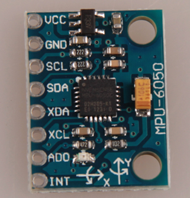

## MPU6050 簡介
YH-MPU6050 是野火科技推出的六軸感測器模組，見圖，
  
它採用 InvenSense 公司的 MPU6050 作為主晶片， 能同時檢測三軸加速度、三軸陀螺儀(三軸角速度)的運動資料以及溫度資料。利用 MPU6050 晶片內部的 DMP 模組（Digital Motion Processor 數位運動處理器）， 可對感測器資料進行濾波、融合處理，直接通過 IIC 介面向主控器輸出姿a態解算後的資料，降低主控器的運算量。其姿態解算頻率最高可達 200Hz， 非常適合用於對姿態控制即時要求較高的領域。常見應用于手機、智慧手環、四軸飛行器、計步器等的姿態檢測。
## MPU6050模块的引脚功能说明