## 2026 年 1 月 31 日到 2 月 8 日（共 8 天 7 夜）上海旅遊行程，含每日景點安排、建議用餐、夜間逛街活動、天氣預測與交通建議（景點皆靠近地鐵或公交）。
由於 1 月—2 月是上海冬季，平均氣溫約 1–10°C，濕冷且偶有雨雪，請攜帶 厚外套、圍巾、手套 并隨時查最新預報。

| 日期      | 主要景點                | 重點活動            |
| ------- | ------------------- | --------------- |
| 1/31（六） | 抵達上海 • 外灘 • 南京路步行街  | 晚上外灘夜景 & 逛街     |
| 2/1（日）  | 豫園 • 城隍廟老街 • 新天地    | 老城文化 + 夜間酒吧/餐飲  |
| 2/2（一）  | 陸家嘴高樓群（東方明珠 / 上海中心） | 摩天觀景 + shopping |
| 2/3（二）  | 上海博物館 • 人民廣場 • 靜安寺  | 室內文化欣賞 + 商圈逛街   |
| 2/4（三）  | 世紀公園 • 世博文化公園       | 公園散步 + 自然休閒     |
| 2/5（四）  | 七寶老街 • 徐家匯商圈        | 古鎮 • 現代商場       |
| 2/6（五）  | 上海迪士尼樂園             | 主題樂園一整天         |
| 2/7（六）  | 田子坊 • 法租界 • 吳江路     | 文青小店 + 美食街      |
| 2/8（日）  | 自由活動 & 離開           | 購物 / 輕鬆市區遊      |


# 上海地鐵路線圖
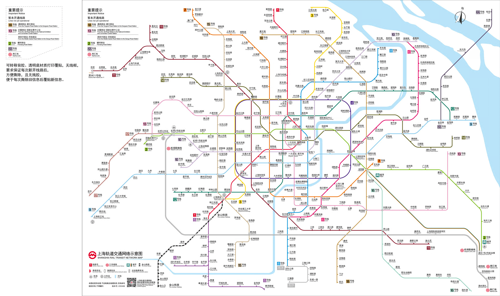

# ☀️ 每日詳細規劃（含交通與美食）
## 📍Day 1 — 1/31（六）抵達上海 + 外灘夜景

#### 天氣預測（典型冬季）：氣溫約 2°C–8°C，濕冷需保暖。

## 上午
```
抵達／入住飯店

休息 + 周邊咖啡館暖身
```
## 下午
```
外灘（The Bund）

經典黃浦江畔歷史建築群，拍照必去。
上海外灘
到訪上海，絕不能錯過外灘。這裡是上海的標誌性景點，沿著黃浦江畔散步，一邊是充滿歷史感的萬國建築群，另一邊是浦東陸家嘴的現代摩天大樓，包括東方明珠、上海中心大廈，兩者對比強烈，帶來彷彿穿梭時空的感覺。
▶︎ 地址：上海市黃浦區外灘中山東一路
▶︎ 交通：地鐵南京東路站二號出口
交通：搭乘 地鐵2、10、14 號線 → 南京東路站，步行即可到。
門票：免費（步道區），如要上觀景台另付費。
```
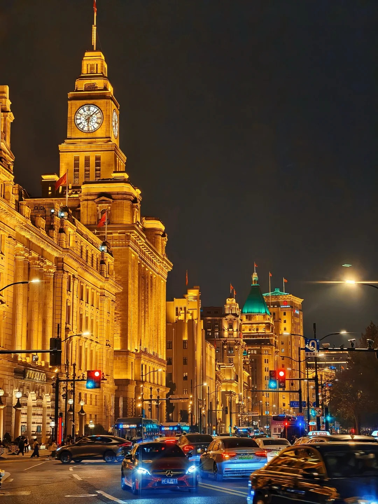
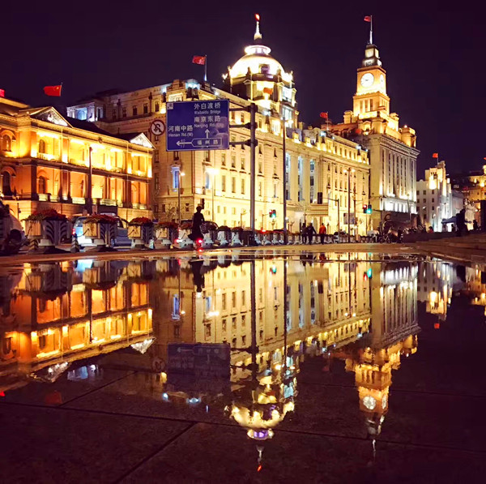
```
南京路步行街 : 
南京路步行街無疑是上海最繁華的地區之一，整條街道佈滿五光十色的霓虹燈與大型百貨公司，從國際品牌到地道老字號均應有盡有，充滿活力。晚上到訪景色更佳，閃爍的燈光配合街頭藝人的表演，氣氛極佳，是感受上海都市脈搏的必到景點。

上海最著名商業街，逛街購物與小吃。
▶︎ 地址：上海市黃浦區南京路
▶︎ 交通：地鐵人民廣場站
```
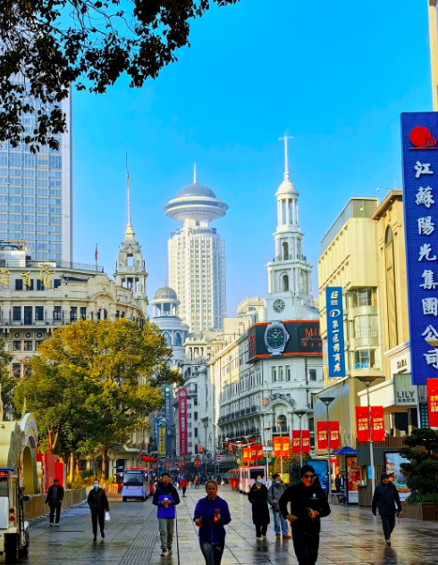
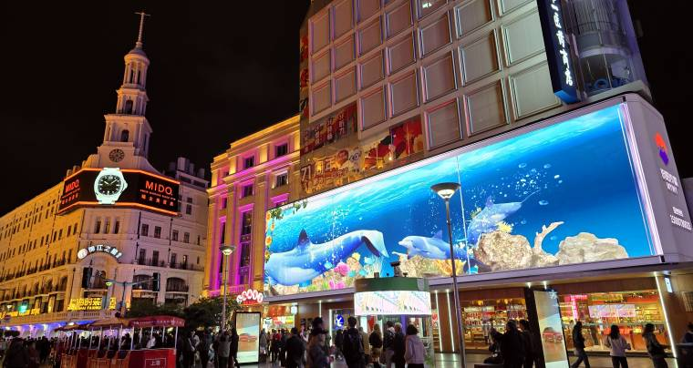
## 晚餐（推薦）

佳家湯包 Jia Jia Tang Bao — 有名小籠湯包（地鐵人民公園站〡附近）。

楊記炸饅頭 Yang’s Fry-Dumpling 小吃。

## 晚上活動

外灘夜景散步 + 拍照

淡水南路或南京路夜間購物

## 📍Day 2 — 2/1（日）豫園 & 新天地慢遊
## 上午
```
豫園（Yu Garden） + 城隍廟老街

在繁華鬧市之中，豫園宛如一個靜謐的世外桃源。這座建於明朝的古典江南園林，佈滿亭台樓閣、小橋流水、假山奇石，每一步皆是風景，充滿詩情畫意。走累了還可到湖心亭品茗，感受古代文人的雅致。

古典園林加城隍廟周邊小吃街。

交通：地鐵 10 號線 → 豫園站
▶︎ 開放時間：08:30-17:30 (旺季) / 08:30-17:00 (淡季)
▶︎ 地址：上海市黃浦區安仁街218號
▶︎ 交通：地鐵豫園站
入園費：大約 ¥30 左右（可線上預約）。
```
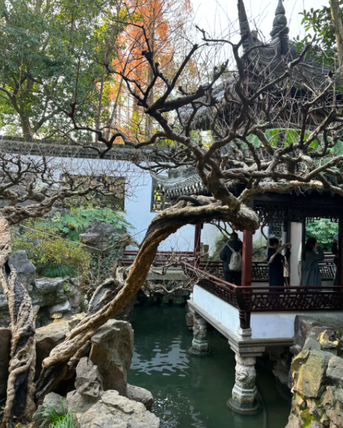
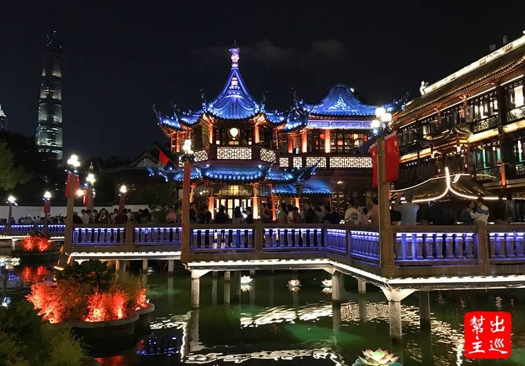
## 午餐

豫園附近 南翔饅頭店（小籠包老店）。

或在城隍廟老街嘗試糖葫蘆、豆花等特色街食。

## 下午
```
新天地 Xintiandi

歷史建築改造的時尚餐飲商圈。
新天地將上海獨有的石庫門建築活化，改造成一個集結了高級餐廳、酒吧、時裝店與藝廊的時尚熱點。這裡完美結合了復古與現代風格，日間可欣賞建築細節，晚上則變成一個甚具情調的地方，許多人都會到此用餐暢飲，感受夜上海的魅力。

新天地是上海新興的地標，融合了上海石庫門建築特色與現代特色商店，中外遊客穿梭期間體驗著與國際接軌的時尚、休閒、餐飲、購物樂趣。保留了石庫門的磚瓦外觀，在其中賦與了現代潮流的新奇事物。入夜之後的新天地，特色酒吧提供著熱鬧非凡的現場演出，眾多的外籍遊客讓新天地彷彿是歐洲的街頭，坐在戶外來杯啤酒真是人生一大樂事！新天地旁邊的「上海一大會址」則是中國共產黨的誕生地，可以憑身分證件免費參觀。
交通：地鐵 10 / 13 / 9 號線 → 新天地站
新天地
▶︎ 地址：上海市黃浦區太倉路181弄
▶︎ 交通：地鐵新天地站6號出口
```
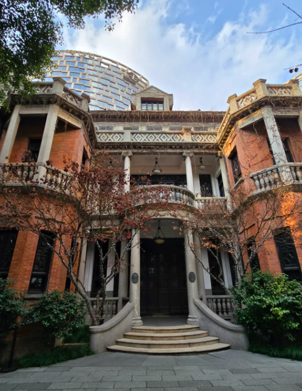
## 晚餐推薦

Lost Heaven on the Bund — 雲南菜（TripAdvisor 推薦）。

若偏向夜生活：Flair Rooftop 高空酒廊。

晚上活動

新天地酒吧街或 衡山路酒吧街步行

## 📍Day 3 — 2/2（一）浦東陸家嘴高樓觀景
## 上午
```
東方明珠電視塔 Oriental Pearl Tower

登塔俯瞰城市。

交通：地鐵 2 號線 → 陸家嘴站
▶︎ 開放時間：09:00-21:00
▶︎ 地址：上海市浦東新區陸家嘴世紀大道1號
▶︎ 交通：地鐵陸家嘴站
```
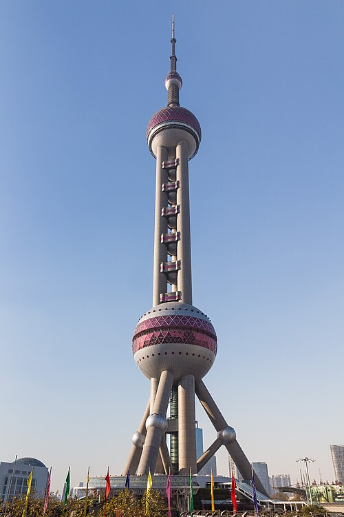
## 午餐

陸家嘴商圈裡的美食廣場或上海環球金融中心商場美食

## 下午
```
上海中心大廈 Shanghai Tower

世界第二高樓觀景台（快速電梯）。
GetYourGuide
```
## 晚餐

陸家嘴附近 鼎泰豐 Din Tai Fung 或浦東商場中餐廳。

## 晚上活動

浦東黃浦江夜景觀光遊船（預約夜遊）。

也可回外灘夜景拍照

## 📍Day 4 — 2/3（二）人民廣場 + 靜安寺
## 上午
```
上海博物館 Shanghai Museum（人民廣場）
上海城市規劃館
中國歷史、陶瓷藝術。

地鐵 人民廣場站 直達。
```
## 午餐

鼎軒中餐廳 或人民廣場附近商場美食。

## 下午
```
靜安寺 Jing’an Temple

歷史佛寺與商圈。

交通：地鐵 7 / 14 號線 → 靜安寺站
```
## 晚餐

靜安寺周邊火鍋或特色餐廳（例如海底撈等）。
```
晚上活動

靜安寺商圈逛街或 K11 購物中心
```
## 📍Day 5 — 2/4（三）世紀公園 & 世博文化公園
## 上午
```
世紀公園 Century Park

上海最大城市公園之一。

地鐵 2 號線 → 世紀公園站
```
## 午餐

公園周邊咖啡或簡餐

## 下午
```
世博文化公園 + 外灘岸邊

休閒散步與拍照。
```
## 晚餐

公園周邊商場

## 晚上活動
```
夜間散步 / 在附近餐廳喝咖啡
```
## 📍Day 6 — 2/5（四）七寶老街 + 徐家匯
## 上午
```
七寶古鎮 Qibao Old Street

歷史舊街有傳統小吃。

交通： 地鐵 9 號線 → 七寶站
```
## 午餐

古鎮土特小吃（如臭豆腐、小籠包等）。

## 下午
```
徐家匯商圈（大型購物中心）

購物與下午茶
```

## 晚餐

徐家匯商場餐廳

## 晚上活動
```
徐家匯酒吧或購物中心夜間逛街
```
## 📍Day 7 — 2/6（五）上海迪士尼一整天
```
上海迪士尼樂園

適合一整天遊玩。

交通：地鐵 11 號線 → 迪士尼站

餐食

額內餐廳解決午晚餐（園區內多選擇）。
```
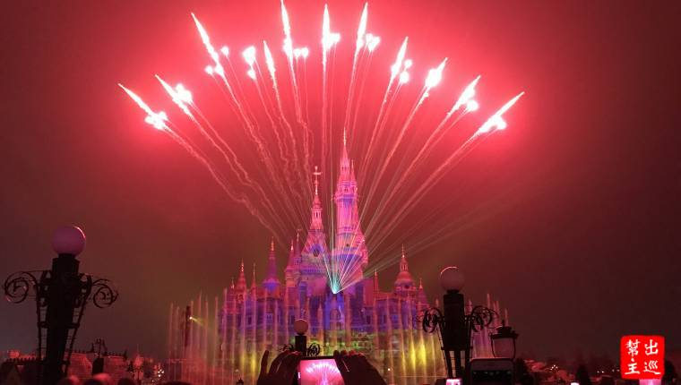
## 夜晚
```
看 夜間煙火表演（通常在園區內晚間）。
```
## 📍Day 8 — 2/7（六）田子坊 & 法租界 & 市區美食
## 上午
```
田子坊 Tianzifang
如今的田子坊範圍越來越大，創意店家、特色餐飲、異國料理都能在此體驗，如同台灣的九份、北京的南鑼鼓巷一般，穿梭在小小的巷弄內隨時會有驚喜，上海老式弄堂的風韻猶存，一磚一瓦、石庫大門、電線縱橫，居民的生活與創意的小店和平共存在這個阡陌縱橫的田子坊內，來，拿出你的探險精神，去發掘躲在角落裡有意思的地方吧！
文青小店、手作市集
地鐵9號線打浦橋站1號出口出站即達
```
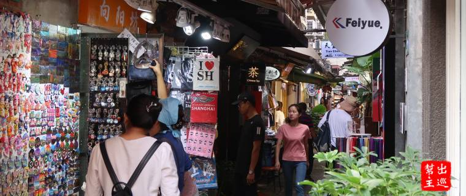
## 午餐

小巷內咖啡或特色餐廳

## 下午
```
法租界梧桐路漫步

特色街區散步拍照
```
## 晚餐

吳江路美食街（各式上海小吃）

## 📍Day 9 — 2/8（日）自由活動 & 離開
```
市區最後購物 or 休閒咖啡

前往機場 / 車站
```

🚇 交通建議

上海地鐵非常便利，景點大多靠近地鐵站（外灘／豫園／迪士尼等）。

使用 地鐵一卡通，或下載上海地鐵 App / 高德地圖離線導航。

🧥 冬季穿著與注意事項

# 1 月底～2 月上旬 寒冷濕冷，氣溫多在 1–10°C。

# 多帶 保暖衣物、雨具、抓地防滑鞋（可能濕滑）。

# 室內多無集中供暖，保暖更重要。