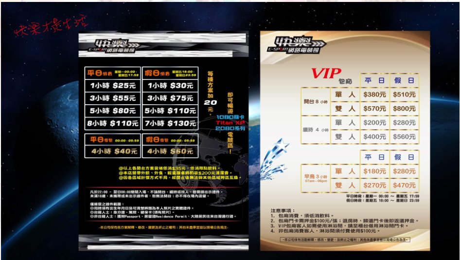
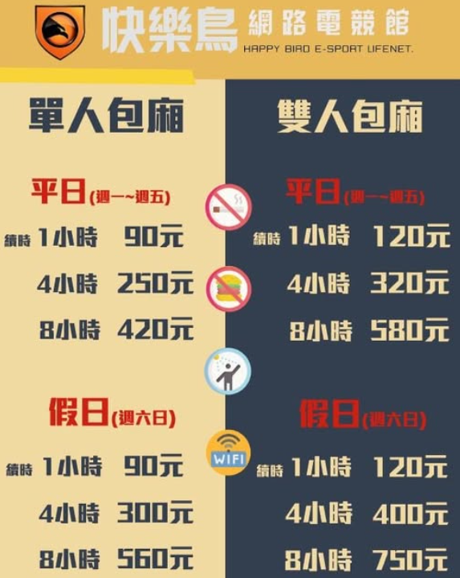
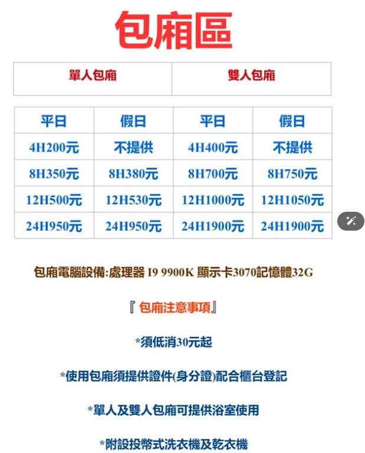
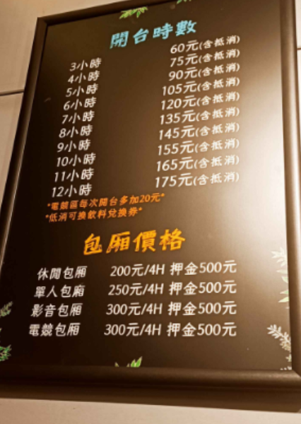
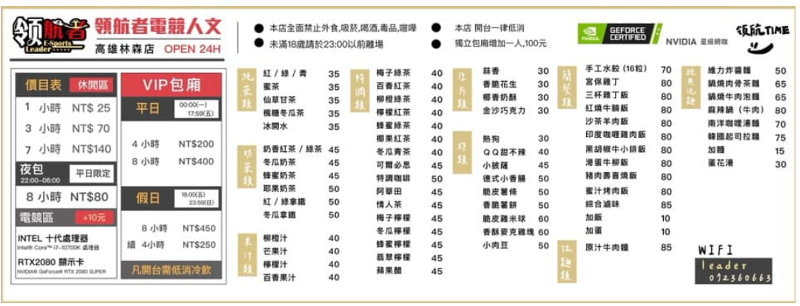

｀## 環島七天六夜旅遊計畫書
### 旅遊日期
- 2023年10月5日（星期日）至2023年10月11日（星期六）
### 旅遊地點
- 台灣環島（新北土城出發，順時針經桃園、新竹、台中、嘉義、台南、高雄、屏東、台東、花蓮、宜蘭、基隆，回到新北）
### 每日行程與午休安排
1. **第一天：新北土城 → 桃園 → 台中市區**（約170km）
``` 2025年10月5日```
    - 上午：新北土城出發，經桃園沿國道/省道南下
    - 旅遊景點：桃園大溪老街、小烏來風景區（天空步道）、苗栗三義木雕博物館
    - **12:00~13:00 午休建議：苗栗三義木雕博物館（苗栗縣三義鄉廣盛村廣聲新城88號）**
    - 下午：抵達台中市區，彩虹眷村、台中公園、逢甲夜市
    - 住宿：台中

2. **第二天：台中 → 彰化 → 嘉義**（約120km）
``` 2025年10月6日```
    - 上午：台中出發，經彰化、雲林至嘉義
    - 旅遊景點：彰化八卦山大佛、雲林劍湖山世界、嘉義檜意森活村
    - **12:00~13:00 午休建議：嘉義文化路夜市（嘉義市東區文化路）**
    - 下午：嘉義市區景點、文化路夜市
    - 住宿：嘉義

3. **第三天：嘉義 → 台南 → 高雄**（約110km）
``` 2025年10月7日```
    - 上午：嘉義出發，騎行至台南、高雄
    - 旅遊景點：台南赤崁樓、安平古堡、台南花園夜市
    - **12:00~13:00 午休建議：台南赤崁樓附近（台南市中西區民族路二段212號）**
    - 下午：高雄龍虎塔、旗津風車公園、六合夜市
    - 住宿：高雄

4. **第四天：高雄 → 屏東 → 台東**（約120km）
``` 2025年10月8日```
    - 上午：高雄出發，經屏東沿南迴公路至台東
    - 旅遊景點：屏東墾丁大街、台東伯朗大道
    - **12:00~13:00 午休建議：台東伯朗大道（台東縣池上鄉）**
    - 下午：三仙台、台東夜市
    - 住宿：台東

5. **第五天：台東 → 花蓮**（約170km）
``` 2025年10月9日```
    - 上午：台東出發，沿花東縱谷北上
    - 旅遊景點：池上飯包文化故事館、瑞穗牧場、花蓮七星潭
    - **12:00~13:00 午休建議：花蓮七星潭（花蓮縣新城鄉海岸路）**
    - 下午：太魯閣國家公園、花蓮東大門夜市
    - 住宿：花蓮

6. **第六天：花蓮 → 宜蘭 → 基隆**（約130km）
``` 2025年10月10日```
    - 上午：花蓮出發，沿蘇花公路北上
    - 旅遊景點：蘇澳冷泉、宜蘭羅東夜市
    - **12:00~13:00 午休建議：宜蘭羅東運動公園（宜蘭縣羅東鎮公正路666號）**
    - 下午：基隆廟口夜市、和平島公園
    - 住宿：基隆

7. **第七天：基隆 → 新北土城**（約40km）
``` 2025年10月11日```
    - 上午：基隆出發，沿北海岸回新北土城
    - 旅遊景點：野柳地質公園、淡水老街
    - **12:00~13:00 午休建議：新北市淡水老街（新北市淡水區中正路）**
    - 下午：返抵新北土城，行程結束
### 交通方式
- 機車自駕環島
### 預算估算
- 交通費：機車油費約NT$1,500
- 住宿費：每晚約NT$1,000，共6晚約NT$6,000
- 餐飲費：每日約NT$500，共7天約NT$3,500
- 門票及其他費用：約NT$2,000
- 伴手禮及雜費：約NT$1,000
- 總預算：約NT$14,000
### 裝備準備
- 機車及相關配件（安全帽、手套、雨衣等）
- 旅遊衣物及個人用品
- 手機及行動電源
- 地圖或導航設備
### 個人衣物
- 輕便服裝（適合騎行）
- 防曬用品（帽子、太陽眼鏡、防曬乳）
- 盥洗用品（牙刷、毛巾、洗髮精等
- 輕便鞋（適合長時間騎行）, 拖鞋.
- 三套換洗衣物
- 個人電子設備及充電器
### 行程距離
- 第一天：約170km
- 第二天：約120km
- 第三天：約110km
- 第四天：約120km
- 第五天：約170km
- 第六天：約130km
- 第七天：約40km
### 當地天氣預報
- 10月5日：晴，氣溫24-30℃
- 10月6日：多雲，氣溫23-29℃
- 10月7日：局部短暫陣雨，氣溫22-28℃
- 10月8日：晴，氣溫24-30℃
- 10月9日：多雲，氣溫23-29℃
- 10月10日：局部短暫陣雨，氣溫22-28℃
- 10月11日：晴，氣溫24-30℃
### 住宿安排
- 第一天：台中市區飯店
#### 參考住宿飯店資訊與價格
- 台中：逢甲商旅 (約NT$1,200/晚)、星享道酒店 (約NT$1,500/晚)\
```網咖 : 逢甲夜市附近有多家網咖，如「逢甲網咖」、「電競網咖」，價格約NT$100-200/小時。```\
逢甲網咖地址：台中市西屯區福星路521號\
電競網咖地址：台中市西屯區文華路71號\
台中快樂Esport網路電競館 : 台中市西屯區福星路480號\
費用含在包廂費不限次數與時間，但水溫難以控制，建議自備盥洗用品。\

---
快樂鳥網路電競館北屯店 : 台中市北屯區文心路四段186號\
3樓公共空間備有淋浴間如要使用要另加$50元會給沐浴用品。\
VIP包廂區飲料一樣無限暢飲\

- 第二天：嘉義市區飯店
- 嘉義：蘭桂坊花園酒店 (約NT$1,000/晚)、嘉義觀止 (約NT$1,300/晚)
```網咖 : 嘉義市區有「嘉義網咖」、「電競網咖」，價格約NT$100-200/小時。```\
嘉義網咖地址：嘉義市西區中山路317號\
電競網咖地址：嘉義市西區中山路318號\
安安網咖-垂楊店 : 嘉義市西區垂楊路539號\

---
極速特區24小時網路電競館-嘉義店 : 嘉義市東區吳鳳南路238號\
淋浴間的使用也含在包廂的費用裡\

--- 

- 第三天：高雄市區飯店
- 高雄：漢來大飯店 (約NT$2,500/晚)、高雄福華大飯店 (約NT$1,800/晚)
```網咖 : 高雄市區有「高雄網咖」、「電競網咖」，價格約NT$100-200/小時。```\
高雄網咖地址：高雄市苓雅區中正路123號\
電競網咖地址：高雄市苓雅區和平一路456號\
競宿電競館(高雄鳳山) : 高雄市鳳山區青年路二段226號\
.PNG "高雄市鳳山區青年路二段226號")
領航者電競人文 – 林森店 : 高雄市新興區林森一路251號\
```提供洗衣機$30含洗及脫、烘衣機$40使用30分鐘。```\
```使用熱水需投幣，20元使用20分鐘，免費提供盥洗用品，含毛巾、牙刷…等等。```

--- 
- 第四天：台東市區飯店
- 台東：娜路彎大酒店 (約NT$1,500/晚)、台東桂田喜來登 (約NT$2,000/晚)
```網咖 : 台東市區有「台東網咖」、「電競網咖」，價格約NT$100-200/小時。```\
台東網咖地址：台東市中華路一段456號\
台東可以考慮跳過--
電競網咖地址：台東市中華路二段789號\
網咖24h-台東店 : 台東市中華路一段536號\
--- 
- 第五天：花蓮市區飯店
- 花蓮：美侖大飯店 (約NT$2,000/晚)、花蓮福容大飯店 (約NT$1,800/晚)
- 花蓮艾利斯膠囊背包客 : 花蓮市國盛八街號
- 蜂巢膠囊旅店 : \
-- 飯店電話：0937168173\
-- 飯店地址：花蓮縣花蓮市國民十街一號2樓\
-- 入住時間：15:00之後\
-- 退房時間：11:00之前\
- Sleeping Boot 背包客棧\
-- 花蓮市進豐街73號
---
- 第六天：基隆市區飯店
- 基隆：基隆長官公署 (約NT$1,500/晚)、基隆福華大飯店 (約NT$1,800/晚)
- 第七天：返回新北土城
### 注意事項
- 預訂住宿及交通工具，避免臨時找不到住處或交通工具。
- 注意天氣狀況，攜帶適當的防曬或雨具。
- 保持手機充電，攜帶行動電源以備不時之需。
- 注意交通安全，遵守交通規則，佩戴安全帽。
- 預訂住宿及交通工具，避免臨時找不到住處或交通工具。