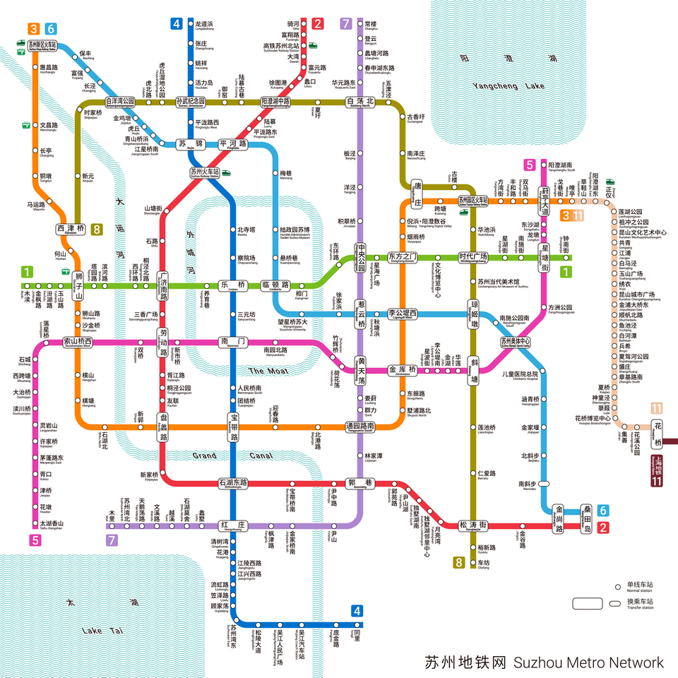

蘇州在七月正值夏季，氣候炎熱潮濕，平均溫度約在 28°C 至 35°C 之間。因此，這份八天七夜的行程規劃特別強調了「避暑」與「夜遊」，白天多安排在博物館或綠蔭較多的園林，傍晚則深入古街夜市感受姑蘇風情。

## 📅 蘇州 8 天 7 夜深度旅遊行程

| 星期日 | 星期一 | 星期二 | 星期三 | 星期四 | 星期五 | 星期六 |
| ----- | ------ | ----- | ------ | ----- | ------ | ----- |
|  6/28 |   6/29 |  6/30 |   7/1  |  7/2  |   7/3  |  7/4  |
|  7/5  |   7/6  |  7/7  |   7/8  |  7/9  |   7/10 |  7/11 |
|  7/12  |  7/13 |  7/14 |   7/15 |  7/16 |   7/17 |  **7/18** |
|  **7/19** |   **7/20** |  **7/21** |   **7/22** |  **7/23** |   **7/24** |  **7/25** |

| 天數 | 主題路線 | 白天行程 (避暑/室內為主) |	晚上行程 (夜市/夜遊)|  
| - | -------- | ----------------------- | ------------------ |
|D1 | 初見姑蘇	| 蘇州博物館(本館)、拙政園	| 觀前街、太監弄美食街|
|D2	| 水鄉韻味	| 獅子林、平江路歷史街區 |	平江路夜步、聽評彈|
|D3	| 吳中第一	| 虎丘、留園	| 七里山塘街 (看紅燈籠夜景)|
|D4	| 千年鐘聲	| 寒山寺、楓橋景區、西園寺(吃素麵)	| 石路步行街、南浩街|
|D5	| 現代蘇州	| 蘇州中心、誠品書店、李公堤	| 金雞湖夜遊、噴泉表演|
|D6	| 古鎮慢活	| 同里古鎮 (退思園)	| 同里古鎮夜色 (宿古鎮)|
|D7	| 湖光山色	| 靈岩山寺、木瀆古鎮	| 斜塘老街 (仿古建築商業街)|
|D8	| 市井煙火	| 雙塔市集(文青菜市場)、葑門橫街	| 準備返程|
## 🚇 交通規劃：地鐵沿線景點對照表
蘇州地鐵非常發達，建議下載「蘇州地鐵蘇e行」App 或使用支付寶/微信交通乘車碼。
蘇州地鐵目前已形成非常成熟的網狀結構，對於遊客來說，1號線、2號線、4號線與5號線是最核心的生命線。

|地鐵線路	|   主要站點	|   鄰近景點
|   ------  |   ------  |   ------  |
|1 號線	| 相門站 / 臨頓路站	| 蘇州博物館、拙政園、平江路、觀前街|
|1 號線	| 東方之門站	| 金雞湖、蘇州中心、之門燈光秀|
|2 號線	| 山塘街站	| 七里山塘街|
|2 號線	|石路站	|留園、石路步行街|
|3 號線	|東方之門站	(與 1 號線換乘) |金雞湖周邊|
|4 號線	|察院場站	|觀前街西側、怡園|
|4 號線	|同里站	|同里古鎮 (出站需轉接駁公車 725 路)|
|5 號線	|斜塘站	|斜塘老街|

| 線路|標誌顏色|定位與核心景點|重要轉乘站|
|   ----    |   ----    |   ----    |   ----    |  
|1 號線|綠色|東西骨幹：串聯古城區、觀前街、金雞湖（東方之門）。|廣濟南路(轉2)、樂橋(轉4)|  
|2 號線|紅色|南北幹線：連接高鐵站（蘇州北）與山塘街。|廣濟南路(轉1)、火車站(轉4)|  
|3 號線|橙色|環型骨架：主要服務新區與園區，與11號線貫通。|寶帶路(轉4)|  
|4 號線|藍色|南北生命線：直達同里古鎮，經過市中心觀前街區。|樂橋(轉1)、火車站(轉2)|
|5 號線|品紅色|旅遊專線：經過太湖與斜塘老街。|蘇州奧體中心|
|11 號線|白色|跨城專線：連接蘇州市區與崑山、上海地鐵11號線。|唯亭(轉3)|

💡 蘇州地鐵搭乘深度說明 :  
1. 如何快速轉乘？
樂橋站 (1號線/4號線)： 這是蘇州地鐵最核心的轉乘點。如果您住在觀前街附近，這裡是您的出發中心。
廣濟南路站 (1號線/2號線)： 這裡是前往「山塘街」或從「蘇州火車站」過來時最常經過的轉乘站。
蘇州火車站 (2號線/4號線)： 如果您是搭乘高鐵到達蘇州站（注意不是蘇州北站），直接在此站換乘地鐵即可入城。
2. 行程中的關鍵站點說明
臨頓路站 (1號線)： 離 蘇州博物館、拙政園 最近。
出站後沿著齊門路步行約 10-15 分鐘可達。
東方之門站 (1號線/3號線)： 這裡是蘇州現代化的地標（人稱「大秋褲」），蘇州中心商場 與 金雞湖水幕秀 都在這。
山塘街站 (2號線)： 1號出口出來就是古街入口，晚上看燈籠夜景必來。
同里站 (4號線)： 這裡是 4 號線的最南端終點站，出站後需轉乘公車或景區接駁車前往古鎮核心區。
3. 支付方式建議電子乘車碼： 推薦在支付寶（Alipay）或微信（WeChat）搜索「蘇州地鐵乘車碼」或「蘇e行」。
實體旅遊卡： 蘇州有發行 1日票 (18 RMB) 或 3日票 (40 RMB)，如果您一天之內搭乘超過 5-6 次，買日票會更划算。

## 門票與路線預估
🏮 蘇州核心景點門票與路線明細 (2026 預估)
|景點名稱|門票預估 (旺季)|交通路線 (地鐵/步行)|建議停留|
| ---- | ---- | ---- | ----|
|拙政園 | ¥90 | 地鐵 1 號線「臨頓路」/ 4 號線「樂橋」轉公車 | 2.5 小時 |
|蘇州博物館 | 免費 (須預約) | 位於拙政園隔壁，步行 3 分鐘 | 2 小時 |
|獅子林 | ¥40 | 位於拙政園附近，步行 5 分鐘 | 1.5 小時 |
|虎丘 | ¥80 | 地鐵 2 號線「山塘街」轉公車或打車 | 3 小時 |
|留園| ¥55 | 地鐵 2 號線「石路站」1 號口步行約 10 分鐘 | 1.5 小時 |
|寒山寺 | ¥20 | 地鐵 1 號線「西環路」轉公車或打車 | 1 小時 |
|七里山塘 | 免費 (部分小景點收費) | 地鐵 2 號線「山塘街」站直達 | 2 小時 (建議夜遊) |
|同里古鎮 | ¥100 | 地鐵 4 號線「同里站」轉接駁公車 725 路 | 一整天 |
|金雞湖 (東方之門)| 免費 | 地鐵 1 號線「東方之門」站直達 | 1.5 小時 |

## 🍽️ 美食推薦與餐廳清單
蘇州美食講究「不時不食」，七月推薦嘗試 三蝦麵、清炒蝦仁、響油鱔糊。

1. 必吃名店 (老字號)
松鶴樓 (觀前店/山塘店)： 必點「松鼠桂魚」，是蘇幫菜的代表。

得月樓 (觀前店)： 經典蘇式燉菜、美味醬方（紅燒肉）。

協和菜館： 比較平價且道地的蘇幫菜，深受在地人喜愛。

2. 街頭小吃與特色餐飲
蘇式湯麵： 同得興 (七月有楓鎮白肉麵)、裕興記 (三蝦麵)。

小吃： 祥鑫飲食店 (赤豆小圓子、雞腳)、潘玉麟糖粥 (需排隊)。

素齋： 西園寺素麵 (如意麵、觀音麵)，便宜且充滿禪意。

### 🍱 蘇州必吃小吃清單 (2026 預估)
蘇州的小吃文化（蘇式點心）講究精緻、軟糯且帶有甜味。針對您的需求，我整理了一份蘇州必吃小吃地圖，這些地點全部都在地鐵站步行可達的範圍內，非常適合 7 月旅遊時輕鬆移動。
|小吃類別|推薦必吃品項|預估費用 (RMB)|推薦地點 / 店家|最近地鐵站|
| ---- | ---- | ---- | ---- | ---- |
|生煎類|鮮肉生煎、泡泡餛飩|¥18 - ¥30|啞巴生煎 (臨頓路店)|4 號線 - 察院場站 / 1 號線 - 樂橋站|
|湯麵類|楓鎮白肉麵 (夏季限定)、三蝦麵|¥30 - ¥120|同得興、裕興記 (觀前街附近)|1 號線 - 臨頓路站|
|甜點類|糖粥、赤豆小圓子、海棠糕|¥5 - ¥15|潘玉麟糖粥、祥鑫飲食店|1 號線 - 相門站 / 臨頓路站|
|糕團類|炒肉團子、薄荷糕、青團|¥5 - ¥20|黃天源、明月樓|4 號線 - 察院場站 (觀前街)|
|熟食類|鹽水鵝、爆魚、醬汁肉|¥20 - ¥50|陸稿薦、葑門橫街 各小店|5 號線 - 竹輝橋站|
|小籠類|蟹粉小籠、緊酵饅頭|¥25 - ¥50|熙盛源、萬福興|2 號線 - 石路站 / 山塘街站|

### 📍 三大「小吃集中地」深度指南
1. 觀前街 & 太監弄（最豐富、最經典）
這裡是蘇州老字號最集中的地方，適合一次打卡多個品牌。  
如何到達： 地鐵 4 號線【察院場站】2 號口或 1 號線【樂橋站】。  
推薦流程：  
- 先去 啞巴生煎 吃一份爆汁生煎配餛飩（¥25）。
- 到 黃天源 買兩塊軟糯的糕團（¥10）。
- 去 陸稿薦 秤一點無錫醬排骨或醬汁肉帶回飯店當宵夜。

2. 葑門橫街（最市井、CP值最高）
這是一條長約 700 公尺的露天菜市場老街，是老蘇州人的廚房。
如何到達： 地鐵 5 號線【竹輝橋站】西北口出。
推薦流程：
- 老攤頭爆魚： 現殺現炸，外酥裡嫩（¥25/斤）。
- 周媽媽香粽： 蘇州口味的灰湯粽非常出名。
- 趙天源/黃富興： 必買夏季限定的「炒肉團子」（裡面有蝦仁、筍丁，鮮美無比）。

3. 平江路 & 山塘街（最有氛圍、適合夜遊）
這兩條街適合邊逛邊吃，尤其 7 月晚上氣氛極佳。
如何到達： 平江路【相門站/臨頓路站】；山塘街【山塘街站】。
推薦流程：
- 雞腳旮旯： 在平江路的小巷裡買一袋滷雞腳（¥20/份）。
- 桂花糖粥： 在平江路找路邊老攤位喝一碗軟糯的糖粥（¥10）。
- 朱新年點心店： 位於山塘街附近，湯圓（芝麻/肉餡）非常有名。

## 💡 旅遊小貼士
景點預約 (重要)： 蘇州博物館、拙政園、獅子林 必須提前在官方微信公眾號預約，七月暑假期間門票非常搶手，建議提早 3–7 天刷票。

避暑建議： 七月午後常有陣雨或烈日，建議 12:00–15:00 安排在蘇州博物館、誠品書店或是有空調的商場內。

夜市文化： 蘇州的夜市多為「步行街」形式，雙塔市集 結合了傳統菜場與文青美食，是非常適合拍照與吃下午茶的地方。

金雞湖噴泉： 通常在週五、週六晚上有表演，建議提早半小時在地鐵 1 號線「東方之門站」出站找位置。