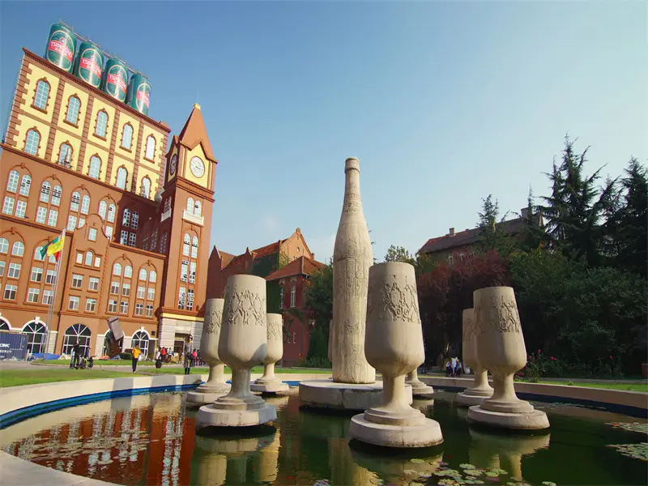
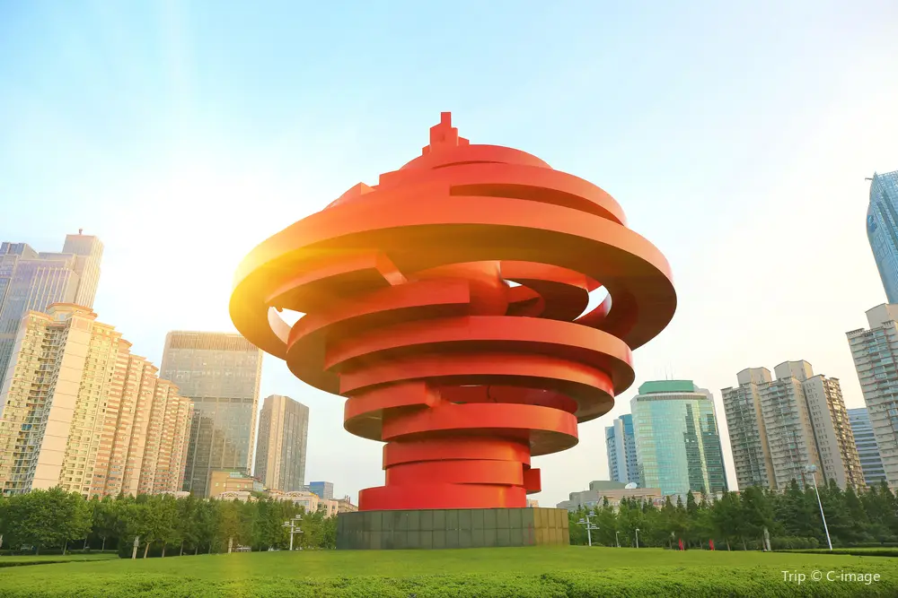

# 📆 青島 8 天 7 夜 行程總覽（7/1–7/7）

## 📍青島屬溫帶季風氣候，7 月平均氣溫約 23–29°C，有時會遇到午後雷陣雨（晴熱、濕度高，建議帶雨具與防曬用品）

## 辦理台胞證加簽
| 星期日 | 星期一 | 星期二 | 星期三 | 星期四 | 星期五 | 星期六 |
| ----- | ------ | ----- | ------ | ----- | ------ | ----- |
|  6/28 |   6/29 |  6/30 |   7/1  |  7/2  |   7/3  |  7/4  |
|  7/5  |   7/6  |  7/7  |   7/8  |  7/9  |   7/10 |  7/11 |
|  7/12  |  7/13 |  7/14 |   7/15 |  7/16 |   7/17 |  7/18 |
|  7/19 |   7/20 |  2/21 |   2/22 |  2/23 |   7/24 |  7/25 |

## 🚇 交通與小提醒

### 📌 青島捷運（Metro）＋公車網絡很方便，多數市區景點可搭捷運 Line 3 或 Line 2轉公車抵達

### 📲 建議下載 Qingdao Metro App / 高德地圖 使用路線導航（中文路線最佳）
#### 青島地鐵路線站點和營運時間
### 地鐵1號線
## 路線：東郭莊 ↔ 溝岔 ↔ 農業大學 ↔ 正陽中路 ↔ 小寨子 ↔ 鳳崗路 ↔ 流亭 ↔ 仙家寨(汽車北站) ↔ 瑞金路 ↔ 遵義路 ↔ 南嶺 ↔ 興國路 ↔ 永年路 ↔ 滄安路 ↔ 青島北站 ↔ 安順路 ↔ 水清溝 ↔ 北嶺 ↔ 小村莊 ↔ 海泊橋(海慈醫療) ↔ 台東 ↔ 廣饒路 ↔ 觀象山(市立醫院) ↔ 中山路 ↔ 青島站 ↔ 西鎮 ↔ 團島 ↔ 山里 ↔ 新港山路 ↔ 安子 ↔ 天目山路 ↔ 丁家河 ↔ 王家港
## 首末站點：東郭莊 – 王家港
## 首末班車時間：05:50 – 22:03
## 熱門景點：
## 青島啤酒博物館：位於台東站附近，是了解青島啤酒歷史的最佳地點，同時也可以品嚐地道的啤酒。
## 棧橋：從中山路站步行可達，是青島最具代表性的景點之一，連接藍天與碧海，是必打卡的旅遊地點。
## 中山路：鄰近棧橋和老城區，充滿歷史氛圍的步行街。
## 青島站：重要的交通樞紐，方便連接其他旅遊景點。
### 地鐵2號線
## 路線：李村公園 ↔ 李村 ↔ 棗山路 ↔ 華樓山路 ↔ 東韓 ↔ 遼陽東路 ↔ 同安路 ↔ 苗嶺路 ↔ 石老人浴場 ↔ 海安路 ↔ 海川路 ↔ 海游路 ↔ 麥島 ↔ 高雄路 ↔ 燕兒島路 ↔ 浮山所 ↔ 五四廣場 ↔ 芝泉路 ↔ 海信橋 ↔ 台東 ↔ 利津路 ↔ 泰山路
## 首末站點：李村公園 – 泰山路
## 首末班車時間：06:00 – 22:40
## 熱門景點：
## 青島啤酒博物館：是了解青島啤酒歷史的最佳地點，同時也可以品嚐地道的啤酒。
## 五四廣場：青島的城市地標，以“五月的風”雕塑著稱，非常適合觀景、拍照和散步。
## 青島奧帆中心：位於浮山所站附近，是2008年奧運會帆船比賽的舉辦地，現在是一個現代化的濱海娛樂區域。
## 石老人浴場：天然的海水浴場，非常適合放鬆和水上活動。
### 🎫 多數景點如棧橋是免費或票價低廉，某些特色景點如海底世界、嶗山需門票（後面有詳列）
### 地鐵3號線
## 路線：青島北站 ↔ 永平路 ↔ 振華路 ↔ 君峰路 ↔ 李村 ↔ 萬年泉路 ↔ 海爾路 ↔ 地鐵大廈 ↔ 長沙路 ↔ 雙山 ↔ 清江路 ↔ 錯埠嶺 ↔ 敦化路 ↔ 寧夏路 ↔ 江西路 ↔ 五四廣場 ↔ 延安三路 ↔ 太平角公園 ↔ 中山公園 ↔ 匯泉廣場 ↔ 人民會堂 ↔ 青島站
## 首末站點：青島北站 – 青島站
## 首末班車時間：06:00 – 22:25
## 熱門景點：
## 青島八大關：從中山公園站可達，以歐洲風格的別墅和浪漫的濱海風景聞名，是青島最具特色的景區之一。
## 中山公園：以櫻花著稱，春天的櫻花大道吸引大量遊客。
## 太平角公園：青島最浪漫的公園之一，面朝大海，是拍照的絕佳地點。
## 青島北站：交通樞紐，方便前往青島周邊城市或景點。
## 五四廣場：青島的地標性景點，適合觀景、拍照和悠閒散步。
## 青島海底世界：位於匯泉廣場站附近，是結合海洋生物展示和互動體驗的主題公園，非常適合親子旅行。
## 青島海濱風景區：海泊河公園附近的自然海岸線，擁有多樣的濱海景觀。
### 地鐵4號線
## 路線：大河東 ↔ 登瀛 ↔ 段家埠 ↔ 沙子口 ↔ 小崂山 ↔ 南宅科 ↔ 彭家莊 ↔ 張村 ↔ 科苑經七路 ↔ 董家下莊 ↔ 遼陽東路 ↔ 大埠東 ↔ 埠西 ↔ 勁松三路 ↔ 洪山坡(婦兒醫院) ↔ 福遼立交橋 ↔ 錯埠嶺 ↔ 西吳家村 ↔ 海泊橋(海慈醫療) ↔ 海泊河公園 ↔ 昌樂路 ↔ 泰山路 ↔ 觀象山(市立醫院) ↔ 信號山(青大附院) ↔ 人民會堂
## 首末站點：大河東 – 人民會堂
## 首末班車時間：06:00 – 22:10
## 熱門景點：
## 信號山：青島的最佳觀景點之一，站在山頂可俯瞰整個城市景觀，特別適合攝影愛好者拍照。
## 海泊河公園：一處綠意盎然的休閒空間，非常適合散步和放鬆，享受自然風光。
## 人民會堂：青島市的重要會議及文化活動中心，建築風格獨特，十分值得參觀。
### 地鐵6號線
## 路線：橫雲山路 ↔ 山王河 ↔ 河洛埠 ↔ 青島九中 ↔ 抓馬山 ↔ 馬家樓 ↔ 薛家泊子 ↔ 港頭 ↔ 青大附院西海岸院區 ↔ 扒山 ↔ 錢塘江路 ↔ 九頂山 ↔ 王家港 ↔ 北門外 ↔ 西門外 ↔ 毛家山 ↔ 趙家廟 ↔ 星海灘路 ↔ 華山 ↔ 辛屯 ↔ 靈山灣
## 首末站點：橫雲山路 – 靈山灣
## 首末班車時間：06:00 – 21:30
## 熱門景點：
## 靈山灣：擁有迷人的海灘與清新空氣，是青島西海岸最受歡迎的旅遊目的地之一。
## 抓馬山：適合戶外探險的自然區域，以壯麗的景色而聞名，非常適合喜歡大自然的旅客。
## 星海灘路：這條沿海主幹道擁有多個觀景點和休閒設施，是欣賞濱海風光的最佳選擇。
### 地鐵8號線
## 路線：膠州北站 ↔ 膠東機場 ↔ 膠東 ↔ 大澗 ↔ 紅島火車站 ↔ 健康中心 ↔ 健身中心(紅島會展) ↔ 觀濤 ↔ 紅島科技館(方特) ↔ 大洋 ↔ 青島北站
## 首末站點：膠州北站 – 青島北站
## 首末班車時間：06:00 – 22:00
## 熱門景點：
## 青島膠東國際機場：作為青島的國際航空樞紐，便捷地連接國內外多個城市。
## 紅島科技館(方特)：以科技互動為主題，結合娛樂與教育的家庭旅遊景點，非常適合親子出行。
## 青島北站：青島重要的鐵路樞紐，連接市內和周邊地區，是交通的重要節點。
## 青島方特夢幻王國：從紅島科技館站可到，這是一座融合科技與幻想的主題樂園，適合全家一同體驗。
### 地鐵8號線
## 路線：膠州北站 ↔ 膠東機場 ↔ 膠東 ↔ 大澗 ↔ 紅島火車站 ↔ 健康中心 ↔ 健身中心(紅島會展) ↔ 觀濤 ↔ 紅島科技館(方特) ↔ 大洋 ↔ 青島北站
## 首末站點：膠州北站 – 青島北站
## 首末班車時間：06:00 – 22:00
## 熱門景點：
## 青島膠東國際機場：作為青島的國際航空樞紐，便捷地連接國內外多個城市。
## 紅島科技館(方特)：以科技互動為主題，結合娛樂與教育的家庭旅遊景點，非常適合親子出行。
## 青島北站：青島重要的鐵路樞紐，連接市內和周邊地區，是交通的重要節點。
## 青島方特夢幻王國：從紅島科技館站可到，這是一座融合科技與幻想的主題樂園，適合全家一同體驗。
### 地鐵13號線 – 西海岸快線
## 路線：嘉陵江西路 ↔ 香江路 ↔ 井岡山路 ↔ 積米崖 ↔ 靈山衛 ↔ 學院路 ↔ 朝陽山 ↔ 辛屯(靈山灣) ↔ 兩河 ↔ 隱珠 ↔ 鳳凰山路 ↔ 雙珠路 ↔ 世紀大道 ↔ 盛海路(世博城) ↔ 大珠山 ↔ 張家樓 ↔ 古鎮口 ↔ 龍灣 ↔ 琅琊 ↔ 貢口灣 ↔ 董家口港 ↔ 泊里 ↔ 董家口火車站
## 首末站點：嘉陵江西路 – 董家口火車站
## 首末班車時間：06:10 – 22:00
## 熱門景點：
## 大珠山：作為青島西海岸的自然瑰寶，大珠山以春季的杜鵑花海著稱，讓人流連忘返，尤其適合喜歡攝影的遊客。
## 靈山衛：這是一個靠近海濱的寧靜區域，非常適合散步、享受海風，或者尋求片刻放鬆。
## 世博城(盛海路)：這是一個綜合性的展覽中心，經常舉辦國際展覽和大型活動，周邊還有豐富的商業設施，適合家庭或商務旅客參觀。
| 日期 | 時間 | 活動 | 地點 | 交通方式 | 估計用時 | 費用(¥) | 鏈接 |
| ------ | ---- | ---- | ---- | ---- | ---- | ---- | ---- |
| 7/1 | 08:00 | 抵達+Check-in | 酒店→青島市區 | 出租/地鐵 | 1h | 約20–40 | 
| 7/1 | 10:00 | 栈桥散步 | 栈桥站 | 地鐵 Line 3 → 步行 | 2h | 0 | https://us.trip.com/travel-guide/attraction/qingdao/zhanqiao-park-75648/ |
| 7/1 | 12:30 | 午餐 | 老市區海鮮餐廳 | 步行 | 1.5h | 80–150 | （可用大眾點評查詢）
| 7/1 | 15:00 | 小魚山公園看海景 | 小魚山 | 步行/公車 | 1.5h | 0 |  
| 7/1 | 18:30 | 晚餐 | 登州路啤酒街,公車/步行,2h,120–200, 
| 7/1 | 20:30 | 夜間散步 | 中山路步行街 | 步行 | 2h | 0 | 
| 7/2 | 08:30 | 教堂觀光 | 青島天主教堂 | 公車/步行 | 1.5h | 0 | （官網或大眾點評）
| 7/2 | 10:30 | 八大關建築群 | 八大關 | 公車/步行 | 2h | 0 | https://deepchinatravel.com/qingdao-travel/guides/travel-planning-and-scheduling/ |
| 7/2 | 12:30 | 午餐 | 八大關區海風餐廳 | 步行 | 1.5h | 80–150 |  
| 7/2 | 15:00 | 信號山公園 | 信號山 | 公車/步行 | 2h | 15 | 
| 7/2 | 18:30 | 晚餐 | 台東步行街小吃 | 公車/步行 | 2h | 60–100  
| 7/2 | 20:30 | 夜逛 | 台東夜市 | 步行 | 2h | 0 | 
| 7/3 | 08:30 | 第一海水浴場玩水 | 第一海水浴場 | 公車/出租 | 3h | 0 |  
| 7/3 | 12:30 | 海灘午餐 | 海濱餐廳 | 步行 | 1.5h | 100–180 | 
| 7/3 | 15:00 | 青島海底世界 | 海底世界 | 步行 | 2h | 99–139 | https://touch.piao.qunar.com/touch/detail.htm?cat=from_area%3Dmpl_guestsearch&id=1366 |
| 7/3 | 18:30 | 海景晚餐 | 海景餐廳 | 步行 | 2h | 150–250 | 
| 7/3 | 20:00 | 海灘夜散步 | 第一海水浴場 | 步行 | 2h | 0 | 
| 7/4 | 09:00 | 啤酒博物館 | 青島啤酒博物館 | 地鐵/步行 | 2h | 50 | https://hk.trip.com/travel-guide/attraction/qingdao/tsingtao-beer-museum-10559061/ |
| 7/4 | 12:30 | 午餐 | 啤酒博物館街區餐廳 | 步行 | 1.5h | 100–180 | 
| 7/4 | 15:00 | 啤酒街喝酒小憩 | 登州路啤酒街 | 步行 | 2h | 80–150 | 
| 7/4 | 18:30 | 晚餐 | 啤酒街美食 | 步行 | 2h | 120–200 | 
| 7/4 | 20:30 | 夜生活 | 登州路酒吧街 | 步行 | 3h | 120–300 | 
| 7/5 | 08:30 | 五四廣場 | 五四廣場 | 地鐵 Line 3,2h,0,https://deepchinatravel.com/qingdao-travel/guides/travel-planning-and-scheduling/ |
| 7/5 | 11:30 | 奧帆中心散步 | 奧帆中心 | 步行/公車 | 2h | 0 |  
| 7/5 | 13:30 | 午餐 | 五四廣場海景餐廳 | 步行 | 1.5h | 120–220 | 
| 7/5 | 16:30 | 明月山海經不夜城 | 不夜城 | 步行 | 2h | 0 | 
| 7/5 | 18:30 | 晚餐 | 不夜城夜市 | 步行 | 2h | 80–150 |  
| 7/5 | 20:30 | 夜市逛街 | 不夜城 | 步行 | 2h | 0 | 
| 7/6 | 07:30 | 嶗山一日遊 | 嶗山風景區 | 地鐵/公車轉乘 | 8h | 90–140 | https://m.qd.bendibao.com/tour/jingdianbao/ |
| 7/6 | 12:00 | 山中午餐 | 嶗山景區內 | 步行/景區餐廳 | 1h | 80–150 |  
| 7/6 | 18:30 | 回市區晚餐,本地菜館,公車/出租,2h,100–180, 
| 7/6 | 20:30 | 市區夜逛 | 可選商圈 | 步行 | 2h | 0 | 
| 7/7 | 09:00 | 舊城區散步 | 德式古街 | 公車/步行 | 2h | 0 | 
| 7/7 | 12:00 | 午餐 | 老街老店 | 步行 | 1.5h | 80–130 | 
| 7/7 | 14:30 | 購物與散步 | 中山路商圈 | 步行 | 2h | 0 | 
| 7/7 | 17:30 | 結束行程/返回 | 出發回程 | 出租/地鐵 | 1–2h | 約20–40 | 

-- 
# 🗓 Day 1 — 抵達青島 & 城區海濱散步

🎯 景點

🇨🇳 栈桥（Zhanqiao Pier）：青島經典海景長橋、拍照景點，免費開放（回澜阁另收少量票或免費看海景）

🇨🇳 小魚山公園 / 鲁迅公園：可以俯瞰八大關/港灣海景（免費）
栈桥是青島標誌性的景點之一。這條海上長橋延伸至大海之中，成為欣賞海景的絕佳地點。您可以準備一些面包屑來餵海鷗，並在海天一線的風景中留下難忘的瞬間。栈桥尤其適合拍攝早晨或黃昏的海景照。

🍱 中餐推薦

老市區海鮮小館（Near 棧橋 / 中山路）：烤魷魚、辣炒蛤蜊、啤酒炒海鮮
👉 典型青島海鮮合菜人均約 ¥80–150

🍽 晚餐推薦

登州路登州路啤酒街：青島啤酒 + 海鮮大排檔（經典旅遊地標）

🌆 夜間行程

棧橋夜景 + 中山路淡水街夜晚散步

📍交通：捷運 Line 3 → 栈桥站 → 步行可達

🗓 Day 2 — 歷史與文化巡禮

🎯 景點

### 青島天主教堂（聖彌厄爾大教堂）：德式哥德建築
青島的天主教堂是德國佔領時期的遺跡，其哥德式建築風格和高大的鐘樓非常壯觀。許多人在這裡拍攝婚紗照，教堂周圍的建築和街景也頗具特色，是網紅打卡地。
### 八大關景區（Badaguan）：歐式建築街
八大關風景區被稱為「萬國建築博覽館」，匯聚了俄羅斯、德國、法國等多國風格的別墅建築，這裡的每一幢別墅都具有濃厚的異國情調。八大關也是拍照的絕佳地點，四季風景各異，春有桃花、夏有綠樹、秋有金黃、冬有雪景，非常適合遊客漫步拍照。
### 信號山公園：全景俯瞰青島老城（票約 ¥15）

🍱 中餐

海風餐廳（八大關區）：特色西式海鮮或本地菜

🍽 晚餐

台東步行街：特色小吃（烤串、啤酒配小吃）

🌃 夜逛

台東夜市／台東步行街商圈

📍交通：捷運 Line 3 → 八大關／公車到信號山

🗓 Day 3 — 海灘度假 + 青島海底世界

🎯 景點

## 第一海水浴場：經典海灘 + 泳場

### 青島海底世界（水族館）：成人 ~¥99–139（含看海洋生物展示）
青島極地海洋公園是青島最受親子歡迎的景點，公園內飼養世界各地的海洋生物，包括來自極地的企鵝、北極熊、海象、白鯨等，配合精彩的表演，成為青島地鐵沿線必去的景點之一。

地址：山東省青島市嶗山區東海東路 60 號
地鐵：乘坐青島地鐵至海游路站，步行 5 分鐘即可到達

🍱 中餐

海灘旁海鮮餐廳：中式海鮮拼盤或沙灘扒房

🍽 晚餐

海景餐廳：建議試試「薑蔥蒸大蝦＋青島啤酒」

🌆 夜逛

第一海水浴場沙灘散步（看夜海與街頭表演）

📍交通：搭公車/的士前往海灘，海底世界步行可達

🗓 Day 4 — 青島啤酒博物館 + 啤酒街

🎯 景點

## 青島啤酒博物館：可了解啤酒歷史、參觀與試喝（門票約 ~¥50）
說到青島，不少人第一時間都會想起青島啤酒！青島啤酒是外國人最熟悉的中國啤酒品牌，去青島旅行，除了品嘗青島啤酒外，更不要錯過前往青島啤酒博物館參觀。青島啤酒博物館以互動及影像方式，趣味展示青島啤酒百年釀酒歷史、製作工序，更可以試飲最新鮮的青島啤酒呢！

- 地址：山東省青島市市北區登州路 56 號
- 地鐵：乘坐青島地鐵至台東站，步行 10 分鐘即可到達

🍱 中餐

博物館附近啤酒街餐廳：炸海鮮拼盤、啤酒拼盤

🍽 晚餐

啤酒博物館旁餐廳：搭配青島啤酒的海鮮料理

🎉 夜逛

登州路啤酒街酒吧一條街

📍交通：捷運 Line 3 → 登州路站或步行到博物館

🗓 Day 5 — 五四廣場＆奧帆中心

🎯 景點

## 五四廣場 Waterfront Plaza：現代市民廣場（免費）

奧林匹克帆船中心（Olympic Sailing Center）：適合海濱散步

明月山海經不夜城（夜間主題街）
五四廣場因「五四運動」而得名，象徵中國愛國主義精神，並成為青島的地標性景點之一。廣場中央的紅色雕塑成為打卡熱點外，廣場附近更可欣賞青島沿岸景色，加上青島曾為 2008 年北京奧運帆船比賽的城市，參觀時不妨乘坐帆船，除了可以欣賞青島天際線外，亦可感受運動員的狀態。

地址：山東省青島市市南區澳門路
地鐵：乘坐青島地鐵至五四廣場站，步行 5 分鐘即可到達

🍱 中餐

海景餐廳（五四廣場商圈）

🍽 晚餐

奧帆中心海景餐廳或廣場街邊美食

🌆 夜逛

明月山海經不夜城夜市區

📍交通：捷運 Line 3 → 五四廣場站

🗓 Day 6 — 嶗山一日遊（自然與佛道聖地）

🎯 景點

## 嶗山風景區（Laoshan Mountain）：天然山海奇景（門票+觀光車 ~¥90–140）
建議規劃整天活動：太清宮古剎、山間步道與海濱景點
崂山是中國的道教名山，山海相依的景觀壯麗無比。崂山擁有奇石、山泉、瀑布，與壯闊的海景相得益彰。無論是登山還是徒步，崂山都是放鬆心情、欣賞自然景色的絕佳選擇。
🍱 中餐

山中餐廳（可嘗試當地茶食與山蘇菜）

🍽 晚餐

回市區後 本地特色菜館

🌆 夜逛

市區酒吧或商圈散步

📍交通：捷運或公車 → 嶗山入口站（部分需公車轉乘）

🗓 Day 7 — 舊城區慢遊 + 購物

🎯 景點

## **琅琊台 / 關山景點（可選）**或信號山再訪拍夜景

德式古街漫步

🍱 中餐

老街老店（手工麵 / 家常味）

🍽 晚餐

台東步行街 / 中山路夜市街邊小吃

🌆 夜逛

中山路商圈 shopping

📍交通：捷運線 & 公車最便利

📌 天氣 & Packing 建議（7 月）

☀️ 平均氣溫約 23–29°C，夏季炎熱有時下雨（午後雷陣雨）
🌦️ 出門帶太陽眼鏡 + 防晒＋雨傘
🍺 海風較濕熱，拍照或海邊活動建議穿透氣服裝

🍽 必吃青島特色美食（不排在某天也可彈性加）

✨ 海鮮拼盤（辣炒蛤蜊／蒜蓉蝦）
✨ 青島啤酒＋烤魷魚
✨ 啤酒街小吃（炸雞塊／烤串）
✨ 海鮮麵線、鮮魚湯