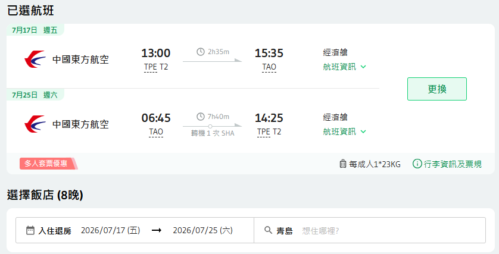
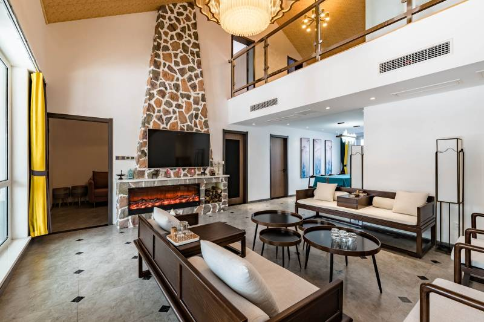
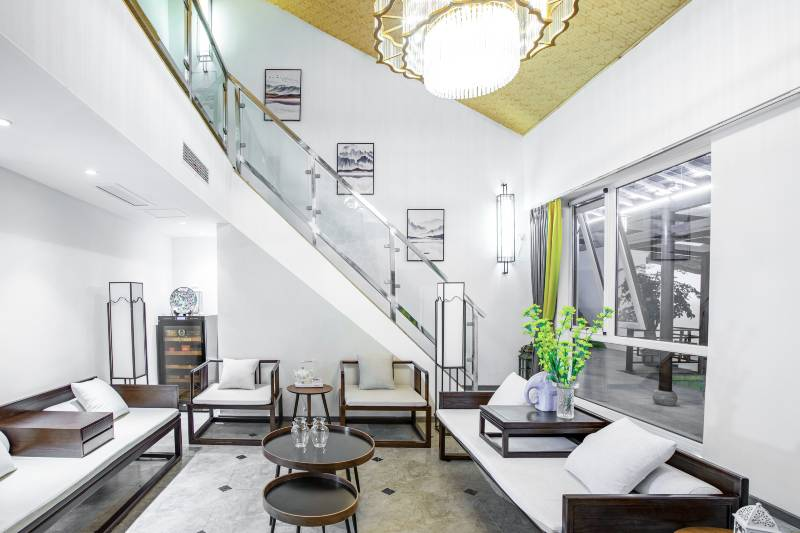
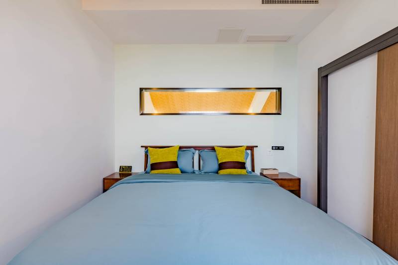
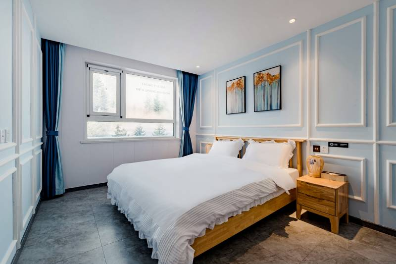
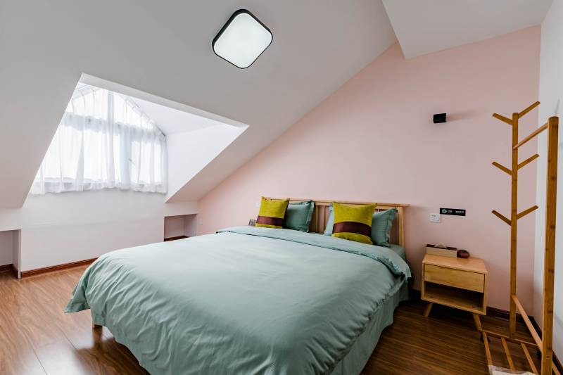

## 7/17 ~ 7/25 住宿規劃
### 機票預訂

### 花築·青島坤鼎別院(嶗山風景區店)
### 地址 : 青島，嶗山區，嶗山景區內王哥莊街道雕龍嘴社區618車站西側100米
#### 靜居雙層尊享套房（四室兩衛豪華庭院景觀+獨立客廳）
### 房型描述
1. 共4間臥室，每間臥室有一張1.8米寬的大床
2. 便利設施 : 
管家服務,針線包,衣架,各種規格電源插座 220V 電壓插座,露營桌椅免費  
3. 多媒體與科技設備  :  
智慧型控制系統,電視,有線頻道,音響,電影,智慧門鎖
4. 食品飲品 :  
咖啡壺/茶壺,茶包,礦泉水免費,電熱壺  
5. 衛浴設備  : 
浴缸或淋浴,私人浴室,私人洗手間,吹風機,浴室化妝,放大鏡,毛巾,浴巾,24 小時熱水,拖鞋  
6. 景觀  
花園景觀,庭院景觀
7. 清潔服務 :    
每日客房清潔,清潔工具  
8. 兒童設施服務 : 
鞦韆與溜滑梯  
9. 沐浴用品 :  
牙刷,牙膏,沐浴乳,洗髮乳,護髮乳,香皂,浴帽,梳子,刮鬍刀
10. 客房設施 : 
空調免費,手動窗簾,自動窗簾,遮光窗簾,寢具：毯子或被子
11. 客房格局 : 
沙發,書桌,茶几,餐桌
12. 用餐區 :
花園/庭院
14. 網路與通訊
客房 Wi-Fi免費

### 房型

